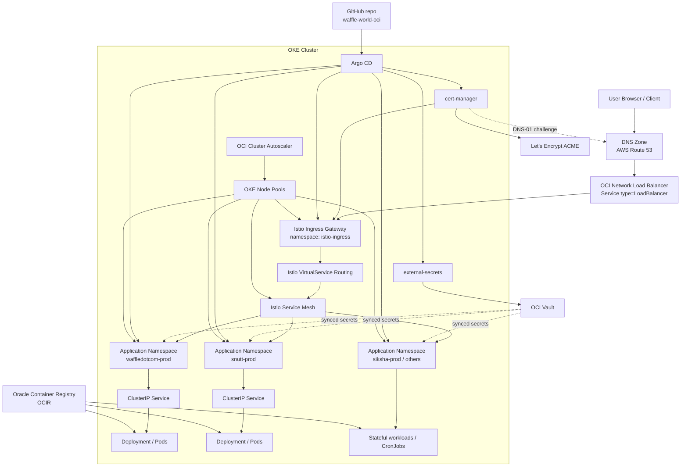
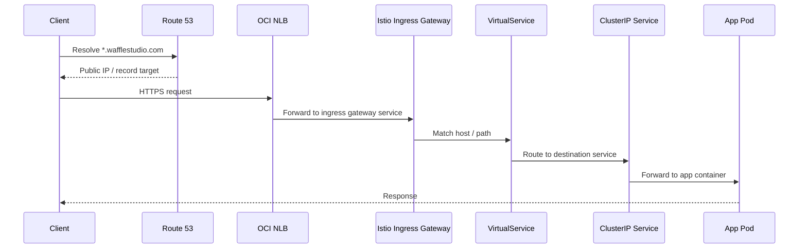
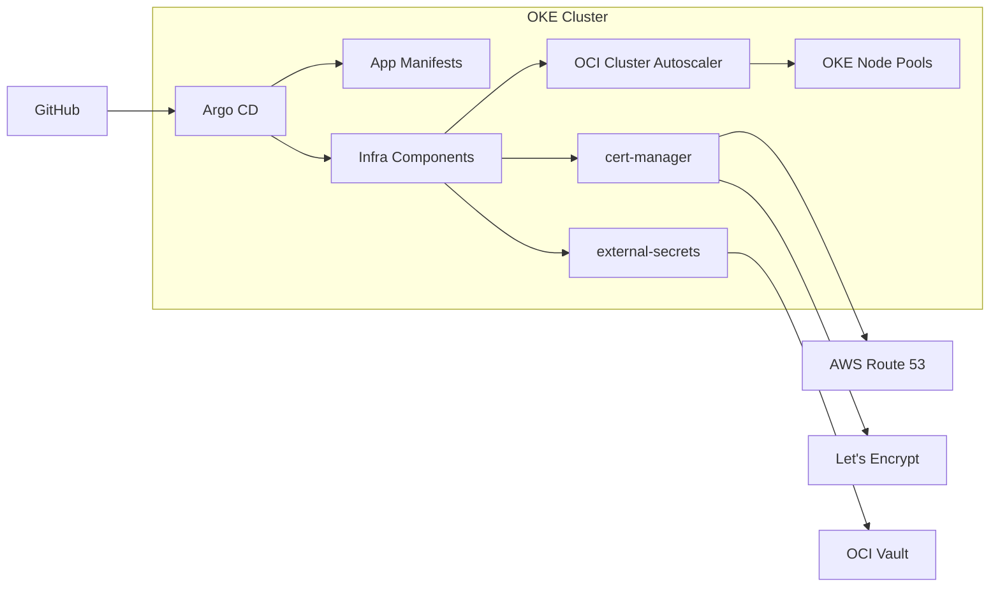

# OKE Cluster Architecture

This document summarizes the current Oracle OKE cluster architecture managed by this repository.

## High-Level View

## Traffic Flow

## Control Plane and Supporting Components

## Component Notes

- `Argo CD` is the deployment controller. The top-level application recursively loads `argocd/*/app.yaml` and continuously syncs the cluster from Git.
- `Istio` provides the service mesh and ingress layer. External traffic enters through the ingress gateway in `istio-ingress`.
- The ingress service is exposed with `Service type=LoadBalancer`, and OCI creates a `Network Load Balancer`.
- `VirtualService` resources map public hosts such as `argocd-oci.wafflestudio.com` or `wadot-api.wafflestudio.com` to internal services.
- `cert-manager` runs inside the cluster and issues TLS certificates using Let's Encrypt. DNS validation is done through AWS Route 53.
- `external-secrets` reads secrets from `OCI Vault` using Oracle-specific provider settings.
- Application pods pull images from `OCIR`.
- `cluster-autoscaler` is configured for OCI and scales OKE node pools.

## Observed Repository Mapping

- GitOps entrypoint: `argocd/top-level.yaml`
- Argo CD installation: `argocd/argocd/`
- Istio control plane: `argocd/istio/`
- Istio ingress gateway and public entrypoint: `argocd/istio-gateway/`
- cert-manager: `argocd/cert-manager/`
- External Secrets + OCI Vault integration: `argocd/external-secrets/`
- OCI cluster autoscaler: `argocd/cluster-autoscaler/`
- Example application namespaces: `argocd/waffledotcom-prod/`, `argocd/snutt-prod/`, `argocd/siksha-prod/`

## Important Detail About DNS

The repository shows a split responsibility:

- Public traffic enters the cluster through an OCI load balancer created from the Istio ingress service.
- TLS certificate issuance uses Route 53 for DNS-01 validation.
- Public DNS for `wafflestudio.com` is delegated to AWS Route 53, even though some services point to Oracle-owned IPs.

That means the architecture is not "AWS load balancer in front of the cluster". It is closer to:

- `AWS Route 53` for DNS hosting and ACME DNS validation
- `OCI Network Load Balancer` for cluster ingress
- `Istio` for L7 routing inside OKE

## Source Files

- [argocd/top-level.yaml](/Users/junby/Coding/waffle-world-oci/argocd/top-level.yaml)
- [argocd/istio-gateway/values.yaml](/Users/junby/Coding/waffle-world-oci/argocd/istio-gateway/values.yaml)
- [argocd/istio-gateway/resources.yaml](/Users/junby/Coding/waffle-world-oci/argocd/istio-gateway/resources.yaml)
- [argocd/cert-manager/resources.yaml](/Users/junby/Coding/waffle-world-oci/argocd/cert-manager/resources.yaml)
- [argocd/external-secrets/resources.yaml](/Users/junby/Coding/waffle-world-oci/argocd/external-secrets/resources.yaml)
- [argocd/cluster-autoscaler/values.yaml](/Users/junby/Coding/waffle-world-oci/argocd/cluster-autoscaler/values.yaml)
- [argocd/waffledotcom-prod/waffledotcom-server.yaml](/Users/junby/Coding/waffle-world-oci/argocd/waffledotcom-prod/waffledotcom-server.yaml)
